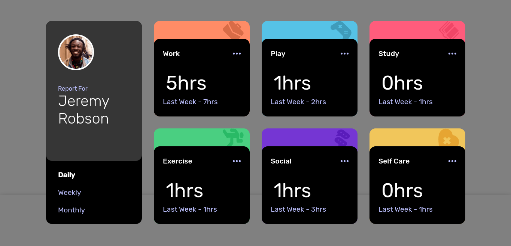

<h1 align="center"> Time Control </h1>

    Desafio do Front-end Mentor com o objetivo de treinar as habilidades com o display grid.

  <a href="#tecnologies">Tecnologias</a>&nbsp;&nbsp;&nbsp;|&nbsp;&nbsp;&nbsp;
  <a href="#project">Projeto</a>&nbsp;&nbsp;&nbsp;|&nbsp;&nbsp;&nbsp;
    <a href="#orientações">Orientações</a>&nbsp;&nbsp;&nbsp;|&nbsp;&nbsp;&nbsp;
  <a href="#desafios">Desafios</a>&nbsp;&nbsp;&nbsp;|&nbsp;&nbsp;&nbsp;
  <a href="#extres">Extras</a>&nbsp;&nbsp;&nbsp;|&nbsp;&nbsp;&nbsp;
  <a href="#memo-licença">Licença</a>

  

 

  

## 🚀 Tecnologias

 Esse projeto foi desenvolvido com as seguintes tecnologias: 

- HTML, CSS e Javascript.

## 💻 Projeto

 O "Time tracking" é um desafio proposto pelo Front-end Mentor cujo objetivo é simplesmente treinar e evoluir suas habilidades com o display grid em CSS. Veja na imagem o desafio proposto. 

  

  <a href="https://www.frontendmentor.io/challenges/time-tracking-dashboard-UIQ7167Jw" target="_blank"> Tente você realizar o desafio, cliquei aqui! </a>

## 🗺️ Orientações

<ul style="margin-left: 20px" id="orientations">
  <li> Não é necessário a instalação de nenhuma dependência.</li>
</ul>

## ⚔️ Desafios enfrentados

  Este projeto teve como principal desafio testar meus conhecimentos em Grid - CSS, pois havia acabado de estudar e queria pôr em prática. 

## 🧑‍🔧 Extras

 
  Algumas Melhorias que devem ser feitas por eu ou até mesmo por você caso queira no futuro:

  <ul style="margin-left: 20px">
      <li> É possível melhorar o código e explorar mais os recursos que o Grid - CSS disponibiliza; </li>
      <li> Você pode deixar os dados dinâmicos e deixá-lo de um jeito que qualquer usuário possa utilizar em seu dia a dia. </li>
  </ul>

<ul style="margin-left: 20px" id="orientations">
    
</ul>

## :memo: Licença

Esse projeto está sob a licença MIT.